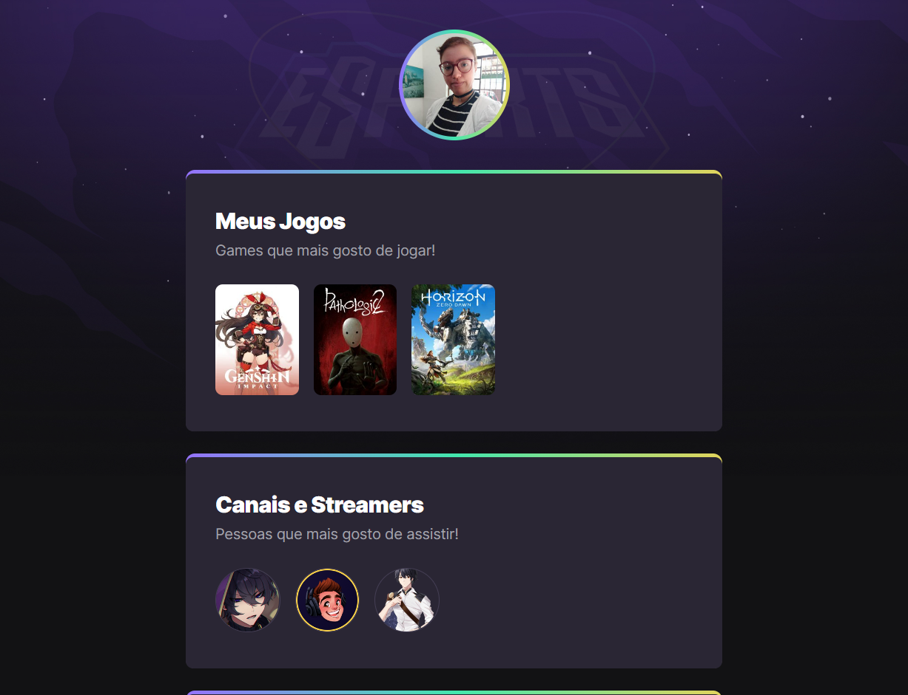

# NLW eSport - Trilha Explorer

Um projeto desenvolvido durante o evento
<b>Next Level Week</b> da Rocketseat.

[Clique aqui para acessar](https://linest-10.github.io/NLW-explorer/)

## <b>Meu aprendizado</b>

Através desse projeto aprendi como criar um site interativo para meu portfólio.
Os principais acréscimos foram: 

- uso do < main > para organizar elementos no < body >
- uso do < div > para separar detalhes especificos no css
- auxilio do Figma como ferramenta para escrever o css
- como acrescentrar e usar atributos no css como display, flex-wrap, border-radius, etc.
- como usar o :hover e o :nth-child
- como acrescentar animações e editar seus atributos no css
- 

## <b>Tecnologias</b>

- HTML
- CSS
- GIT e GITHUB
- FIGMA

## <b>Meus contatos</b>

alinealbuquerqueprofi@gmail.com 
whatsapp (11) 95892-8769